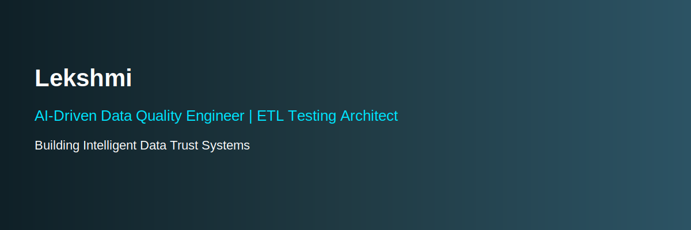

<!-- ===================== PROFILE BANNER ===================== -->

  

# 👋 Hi, I’m Lekshmi Jayan
### AI-Driven Data Quality Engineer | ETL Testing Architect | Cloud Data & Reliability Specialist  
**Building Intelligent Data Systems, Not Just Pipelines**

---

## 🧠 About Me

I design **AI-powered data quality platforms**, **intelligent ETL testing frameworks**, and **cloud-native data reliability systems** that transform raw data into **trusted business intelligence**.

My work sits at the intersection of:

> **Data Engineering × AI × Testing × Cloud × Business Value**

I don’t build scripts — I build **systems, frameworks, and platforms**.

---

## 🚀 What I Build

- 🧠 AI-powered Data Quality Engines  
- 🧪 Intelligent ETL Testing Frameworks  
- ☁️ Cloud-native Data Reliability Platforms  
- 🔍 Data Observability & Trust Systems  
- 📊 Business-driven Data Validation Models  
- 🧬 ML-based Anomaly Detection Pipelines  

---

## 🧠 Core Domains

### 🔹 Data Engineering & Testing
- ETL Testing Frameworks  
- Data Validation Systems  
- Data Reconciliation Engines  
- Schema Evolution Handling  
- Versioned Data Pipelines  
- ACID-compliant Data Systems  
- Data Migration & Integration Testing  

### 🔹 AI for Data Systems
**ML Models**
- Anomaly Detection  
- Pattern Recognition  
- Data Drift Detection  
- Quality Scoring  

---

## ☁️ Cloud & Tech Stack

### 🛠 Tech Stack

**Architecture**
- Modular pipelines  
- Scalable data platforms  
- Event-driven systems  
- Data mesh concepts  
- Platform engineering mindset  

---

## 🧩 Featured Project Themes

> My GitHub is structured as **solution systems**, not random repos.

### 🧠 AI Data Quality Platform
- ML-based anomaly detection  
- Rule-based + AI hybrid validation  
- Business impact scoring  
- Auto-alerting systems  

### 🧪 Intelligent ETL Testing Framework
- Automated data validation  
- Schema drift detection  
- Versioning logic  
- CI/CD integration  

### 📊 Business Data Trust Dashboard
- Data quality metrics  
- Data loss detection  
- Pipeline reliability scoring  
- Decision-trust indicators  

### 🤖 LLM-powered Data Assistant
- Natural language → SQL 

---

## 🎯 Mission

To build **intelligent data systems** where:
- Data is **trusted**  
- Pipelines are **self-validating**  
- Testing is **AI-driven**  
- Quality is **measurable**  
- Decisions are **reliable**  
- Business impact is **visible**  

---

## 🧠 Engineering Philosophy

> “If data is the new oil, then data quality is the refinery.”

I believe:
- Automation > Manual work  
- Systems > Tools  
- Architecture > Code  
- Intelligence > Pipelines  
- Platforms > Projects  
- Products > Proof-of-concepts  

---

## 🤝 Collaboration Interests

- AI startups  
- Data platforms  
- Cloud-native SaaS  
- Data observability tools  
- Testing automation platforms  
- AI reliability systems  
- Business intelligence products  

---

## 📊 GitHub Activity

---

## 📫 Connect with Me

- 💼 LinkedIn: https://www.linkedin.com/in/lekshmijayan93/ 
- 🌐 Portfolio: Coming soon — AI Data Systems Portfolio  
- 📧 Email: lekshmijayan73@gmail.com
